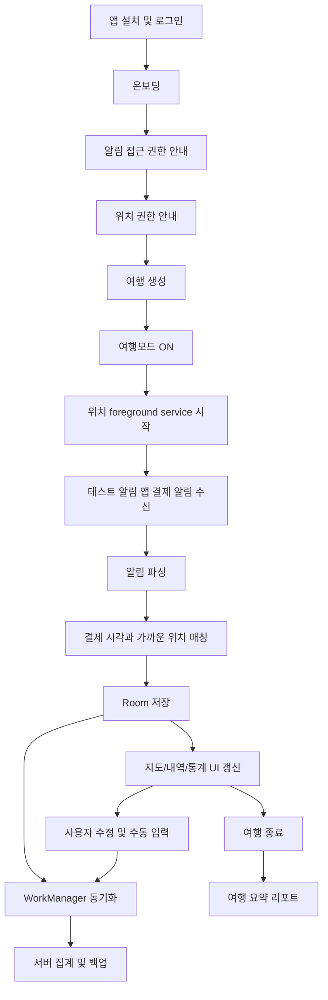

# TRIPLET Android Architecture

## 1. 문서 목적

이 문서는 트립랫 안드로이드 앱을 실제 개발 가능한 수준으로 구조화하기 위한 기준 설계 문서다.

핵심 질문은 아래 네 가지다.

- 사용자가 어떤 흐름으로 앱을 쓰는가
- 안드로이드에서 어떤 컴포넌트로 기능을 나눌 것인가
- 어떤 기술 스택이 MVP에 가장 현실적인가
- 어떤 구조가 발표 내용과 구현 현실을 동시에 만족하는가

## 2. 제품 정의

트립랫은 여행 중 발생한 결제 알림과 위치 데이터를 연결해, 사용자의 여행 동선과 소비 내역을 지도 위에 자동 기록하는 안드로이드 앱이다.

## 2.1 발표용 데모 모드

현재 프로젝트 목표는 실제 상용 배포가 아니라 `발표 시연 가능한 데모 앱`을 만드는 것이다.

따라서 MVP 구현에서는 아래 전제를 둔다.

- 실제 카드사 앱 대신 `테스트용 알림 발송 앱`이 결제 승인처럼 보이는 알림을 보낸다.
- 트립랫은 NotificationListenerService 로 해당 테스트 앱의 알림만 읽는다.
- 테스트 앱의 알림 포맷은 우리가 직접 정의하므로 parser 정확도를 높일 수 있다.
- listener 구조는 parser registry 형태로 유지해 나중에 실제 카드사 앱 parser 로 확장 가능하게 만든다.

### 문제 정의

- 여행 중 결제 내역은 은행/카드 앱에서 보고, 이동 경로는 지도 앱에서 따로 봐야 한다.
- 여행 후 가계부를 수동으로 정리하는 과정이 번거롭다.
- 사용자는 "어디서", "얼마를", "어떤 분야에" 썼는지를 한 화면에서 이해하고 싶다.

### 제품 핵심 가치

- 결제와 위치를 자동으로 연결한다.
- 여행 경로와 소비를 하나의 지도 경험으로 보여준다.
- 여행 종료 후 총지출, 카테고리 비중, 지역별 소비 집중도를 제공한다.

## 3. MVP 범위

### 포함

- 로그인 후 여행 생성
- 여행모드 시작/중지
- 알림 접근 권한을 통한 결제 알림 수집
- 위치 foreground service 기반 위치 샘플 수집
- 결제 시점과 가까운 위치 샘플 자동 매칭
- 홈 지도에서 경로와 소비 마커 표시
- 내역 리스트 및 수동 수정
- 현금/누락 건 수동 입력
- 카테고리별 지출 통계
- 지역별 소비 집중도 시각화
- 서버 동기화

### 제외

- SMS 직접 읽기
- AI 추천
- 위치 기반 광고 푸시
- iOS 지원
- 복잡한 정산 기능

## 4. 핵심 사용자 플로우



## 5. 기술 스택

### 앱

- 언어: Kotlin
- UI: Jetpack Compose
- 아키텍처: MVVM + Repository + UseCase
- DI: Hilt
- 로컬 DB: Room
- 설정 저장: DataStore
- 비동기: Coroutines + Flow
- 백그라운드 동기화: WorkManager
- 지도: Google Maps SDK for Android
- 위치: FusedLocationProviderClient
- 결제 알림 수집: NotificationListenerService

### 서버

- API 스타일: REST JSON
- 인증: Bearer JWT 기반
- DB: PostgreSQL
- 선택 옵션: PostGIS
- 비동기 집계: cron job 또는 worker

### 외부 연동

- Google Maps SDK for Android
- Google Places API 또는 reverse geocoding
- Firebase Crashlytics 또는 Sentry

## 5.1 발표용 2앱 구성

발표용 구현은 아래 두 앱으로 구성한다.

- `Triplet`
  - 여행모드, 지도, 위치, 알림 listener, 가계부 기능 담당
- `Triplet Test Notifier`
  - 결제 승인처럼 보이는 테스트 알림 생성 및 발송 담당

이 방식의 장점은 아래와 같다.

- 실제 카드사 앱 없이도 완전한 데모가 가능하다.
- 지원 카드사별 파싱 이슈 없이 발표 흐름을 통제할 수 있다.
- 알림 권한, 위치 권한, listener 동작을 실제 안드로이드 흐름 그대로 시연할 수 있다.

## 6. 안드로이드 프로젝트 구조

MVP 기준으로는 `단일 app 모듈 + feature 패키지 분리`가 가장 현실적이다.

```text
Fintech/
  demo-notifier/
    build.gradle.kts
    src/
      main/
        AndroidManifest.xml
        java/com/triplet/demo/notifier/
          DemoNotifierApplication.kt
          MainActivity.kt
          feature/
            sender/
            template/
            history/
          notification/
            DemoNotificationChannel.kt
            DemoPaymentNotificationFactory.kt
            DemoNotificationSender.kt
          model/
            DemoPaymentTemplate.kt
            DemoPaymentPayload.kt
  app/
    build.gradle.kts
    proguard-rules.pro
    src/
      main/
        AndroidManifest.xml
        java/com/triplet/
          TripletApplication.kt
          MainActivity.kt
          navigation/
            TripletNavHost.kt
            TripletDestinations.kt
          core/
            common/
              Result.kt
              DispatcherProvider.kt
              TimeProvider.kt
            util/
              CurrencyFormatter.kt
              DateTimeFormatter.kt
              GeoUtils.kt
            ui/
              component/
              theme/
            analytics/
              AppAnalytics.kt
          data/
            local/
              db/
                TripletDatabase.kt
                Converters.kt
              dao/
                TripDao.kt
                ExpenseDao.kt
                LocationSampleDao.kt
                RawNotificationDao.kt
                SyncQueueDao.kt
              entity/
                TripEntity.kt
                ExpenseEntity.kt
                LocationSampleEntity.kt
                RawNotificationEntity.kt
                SyncQueueEntity.kt
            remote/
              api/
                AuthApi.kt
                TripApi.kt
                ExpenseApi.kt
                LocationApi.kt
                StatsApi.kt
              dto/
                request/
                response/
              mapper/
            repository/
              TripRepositoryImpl.kt
              ExpenseRepositoryImpl.kt
              LocationRepositoryImpl.kt
              SyncRepositoryImpl.kt
          domain/
            model/
              Trip.kt
              Expense.kt
              TravelModeState.kt
            repository/
              TripRepository.kt
              ExpenseRepository.kt
            usecase/
              StartTripUseCase.kt
              StopTripUseCase.kt
              ParsePaymentNotificationUseCase.kt
              MatchExpenseLocationUseCase.kt
              SyncPendingDataUseCase.kt
          feature/
            onboarding/
            permissions/
            auth/
            trip/
            home/
            ledger/
            reports/
            settings/
          service/
            notification/
              PaymentNotificationListenerService.kt
              NotificationParserRegistry.kt
              parser/
                PaymentNotificationParser.kt
                DemoPaymentNotificationParser.kt
                parsermodel/
                  ParsedNotificationPayload.kt
                  PaymentCandidate.kt
            location/
              TravelLocationService.kt
              TravelLocationTracker.kt
          worker/
            PendingSyncWorker.kt
            DailyStatsWorker.kt
        res/
          drawable/
          mipmap/
          values/
          values-ko/
          xml/
            backup_rules.xml
            data_extraction_rules.xml
```

## 7. 기능별 책임 분리

### `feature/onboarding`

- 앱 최초 설명
- 여행모드 개념 안내
- 데이터 수집 범위 설명

### `feature/permissions`

- 알림 접근 안내
- 위치 권한 안내
- 권한 재시도 및 설정 이동

### `feature/trip`

- 여행 생성, 편집, 시작, 종료
- 여행모드 상태 제어

### `feature/home`

- 홈 지도
- 이동 경로 polyline
- 소비 마커
- 빠른 통계 카드

### `feature/ledger`

- 자동 수집 내역 리스트
- 수동 입력
- 카테고리 변경
- 금액 수정
- 위치 수정

### `feature/reports`

- 총지출
- 카테고리별 지출
- 지역별 소비 집중도
- 날짜별 소비 흐름

### `service/notification`

- 지원 카드사 앱 알림 필터링
- 알림 파싱
- RawNotification 저장
- Expense 후보 생성

### `service/location`

- 여행모드 중 위치 foreground service 유지
- 위치 샘플 저장
- 정확도 기준 필터링

### `worker`

- 서버 동기화
- 재시도 큐 처리
- 여행 종료 후 집계 재계산

## 8. 핵심 설계 결정

### 결정 1. SMS 대신 알림 접근 권한 사용

이유:

- Google Play SMS 정책 리스크가 크다.
- 트립랫은 default SMS 앱이 아니므로 SMS 권한 승인 가능성이 낮다.
- 발표용 데모는 테스트용 알림 앱만으로도 기능 검증이 가능하다.
- listener 구조는 이후 실제 카드사 앱 parser 로 확장할 수 있다.

### 결정 2. 여행모드가 켜져 있을 때만 위치 수집

이유:

- 프라이버시 설명이 쉬워진다.
- 배터리 소모를 줄일 수 있다.
- 권한 요청 정당화가 명확해진다.

### 결정 3. 위치는 로컬 우선 저장 후 서버 동기화

이유:

- 해외 여행 환경에서 네트워크가 불안정할 수 있다.
- 결제 순간을 놓치지 않는 것이 더 중요하다.
- 오프라인 상태에서도 기능이 유지된다.

### 결정 4. 알림 원문은 로컬 보관 중심, 서버는 구조화 필드 중심

이유:

- 개인정보 리스크 감소
- 재파싱이 꼭 필요하면 짧은 보관 기간만 사용

## 9. 위치 추적 방식

MVP에서는 `foreground service + FusedLocationProviderClient` 조합을 사용한다.

### 기본 원칙

- 사용자가 홈 화면 또는 여행 화면에서 `여행모드 ON` 버튼을 눌렀을 때 시작한다.
- 위치 서비스는 사용자가 직접 시작하는 foreground service 로 동작한다.
- 앱이 백그라운드로 가더라도 서비스가 살아 있는 동안 계속 샘플을 수집한다.
- 서비스가 죽거나 여행모드가 꺼지면 수집을 중단한다.

### 권장 초기 파라미터

- priority: `PRIORITY_BALANCED_POWER_ACCURACY`
- interval: 2분
- min update interval: 30초
- min update distance: 50m
- 결제 직후 1회 보정 샘플 요청 가능

## 10. 결제-위치 매칭 전략

결제 알림이 수집되면 아래 순서로 처리한다.

1. 알림 파싱
2. 금액, 가맹점명, 결제시각 추출
3. 같은 여행의 위치 샘플 중 `결제시각 기준 가장 가까운 샘플` 탐색
4. 시간 차와 정확도 기준으로 자동 확정 또는 검토 필요 상태 부여
5. 장소명 보정이 필요하면 Places API 호출

발표용 데모에서는 `테스트용 알림 앱의 구조화된 extras`를 우선 파싱하고, 시연 안정성을 위해 `보이는 title/text` 파싱을 fallback 으로 둔다.

### 자동 매칭 기준 예시

- 시간 차 5분 이내
- accuracy 50m 이하
- 여행모드 ON 상태

### 검토 필요 조건

- 위치 샘플 없음
- accuracy 100m 초과
- 가맹점 파싱 실패
- 결제시각과 위치시각 차이 큼

## 11. 서버 동기화 전략

### local-first 원칙

- 모든 데이터는 먼저 Room에 기록한다.
- 서버는 백업, 집계, 멀티 디바이스 대비를 위한 보조 저장소다.

### sync 대상

- Trip
- Expense
- LocationSample
- Manual edits
- Soft delete 이벤트

### sync 방식

- `SyncQueueEntity`에 pending 작업 적재
- WorkManager가 네트워크 가능 시 배치 업로드
- 각 레코드는 `client_id` 또는 local UUID 로 idempotent 처리

## 12. 통계 화면 구현 방향

### 총지출

- 여행 단위 합계
- 일자별 합계
- 평균 1회 지출

### 카테고리별 지출

- 식비
- 교통
- 숙박
- 쇼핑
- 관광/액티비티
- 기타

### 지역별 소비 집중도

- MVP는 `행정구역 정교 분석`보다 `grid/geohash 기반 heatmap`을 우선
- 이후 서버에서 지역명 역지오코딩 또는 영역 매핑 추가

## 13. 개발 단계 제안

### Phase 1

- 앱 기본 골격
- 로그인/온보딩
- 권한 플로우

### Phase 2

- 여행 생성/여행모드
- 위치 service
- 알림 listener

### Phase 3

- 결제-위치 매칭
- 홈 지도/내역
- 수동 수정

### Phase 4

- 서버 동기화
- 통계
- 지역별 소비 집중도

## 14. 출시 전 체크포인트

- 지원 카드사 알림 샘플 확보
- 위치 정확도/배터리 테스트
- 여행모드 중 앱 백그라운드 테스트
- 권한 거절 시 fallback UX
- 서버 업로드 재시도와 중복 처리 검증

## 15. 발표 시연 체크포인트

- Triplet 앱에 알림 접근 권한이 허용되어 있는지 확인
- Triplet 앱에 위치 권한이 허용되어 있는지 확인
- 테스트 알림 앱에 POST_NOTIFICATIONS 권한이 허용되어 있는지 확인
- 테스트 알림 앱 패키지명이 allowlist 와 일치하는지 확인
- 테스트 알림 앱의 channel id 와 포맷 버전이 listener 기대값과 일치하는지 확인
