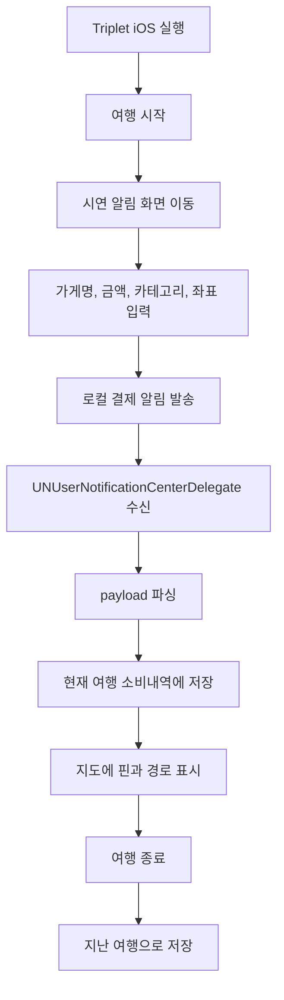

# TRIPLET iOS Architecture

## 1. 문서 목적

이 문서는 기존 Android Triplet 앱의 핵심 경험을 iOS 앱으로 구현하기 위한 기준 설계 문서다.

iOS는 Android와 달리 다른 앱의 알림을 읽을 수 없으므로, 발표 시연용 iOS 버전은 아래 구조로 설계한다.

- 실제 카드사 앱 알림 수집은 제외한다.
- Triplet iOS 앱 내부에서 결제 알림을 직접 생성한다.
- 앱이 생성한 로컬 알림 payload 를 Triplet 앱이 다시 파싱한다.
- 파싱된 결제 내역을 현재 여행의 소비내역과 지도에 추가한다.

참고:

- Apple `UNUserNotificationCenter`: https://developer.apple.com/documentation/usernotifications/unusernotificationcenter
- Apple local notification scheduling: https://developer.apple.com/documentation/usernotifications/scheduling-a-notification-locally-from-your-app
- Apple notification service extension: https://developer.apple.com/documentation/usernotifications/unnotificationserviceextension

## 2. 제품 정의

Triplet iOS는 여행 중 발생한 결제 데이터를 지도 위에 기록하고, 여행 종료 후 지난 여행 기록을 다시 볼 수 있는 iOS 앱이다.

발표용 MVP에서는 실제 카드사/은행 앱 연동 대신 `앱 내부 시연 결제 알림`을 사용한다.

### 핵심 가치

- 여행 중 소비를 지도 위에서 볼 수 있다.
- 결제 순서대로 소비 흐름을 선으로 연결한다.
- 여행 종료 후 지난 여행을 다시 열람할 수 있다.
- iOS 정책 제약을 우회하지 않고 발표 가능한 형태로 시연한다.

## 3. Android 버전과의 차이

| 구분 | Android 현재 구현 | iOS 설계 |
|---|---|---|
| 알림 수집 | `NotificationListenerService` 로 테스트 앱 알림 읽기 | `UNUserNotificationCenter` 로 앱 내부 로컬 알림 처리 |
| 테스트 앱 | 별도 `demo-notifier` 앱 | Triplet iOS 앱 내부 `시연 알림 보내기` 화면 |
| 지도 | Google Maps SDK | MapKit 우선 |
| 위치 | FusedLocationProviderClient | CoreLocation |
| 로컬 저장 | 임시 store 또는 Room 설계 | SwiftData 우선 |
| 지난 여행 | 여행 종료 시 `TripRecord` 저장 | 여행 종료 시 `TripRecord` 저장 |

## 4. iOS 알림 제약과 시연 전략

### 제약

iOS 앱은 다른 앱의 알림 목록을 읽을 수 없다. 또한 앱이 백그라운드에 있을 때 로컬 알림이 도착했다고 해서 앱 코드가 항상 자동 실행되는 것은 아니다.

따라서 "앱이 알림을 보내고 앱이 알림을 읽는다"는 시연은 아래 조건을 기준으로 한다.

- Triplet 앱이 켜져 있는 상태에서 로컬 알림을 보낸다.
- `UNUserNotificationCenterDelegate` 의 foreground notification callback 에서 payload 를 파싱한다.
- 앱이 백그라운드라면 사용자가 알림을 탭했을 때 payload 를 파싱한다.

### 발표용 권장 시연 모드

가장 안정적인 시연은 `앱을 켜둔 상태`에서 진행한다.



## 5. MVP 범위

### 포함

- 여행 시작/중지
- 현재 여행 소비 요약
- 시연 결제 알림 생성
- 로컬 알림 payload 파싱
- 결제 내역 저장
- 수동 소비 입력
- 지도 위 소비 핀 표시
- 결제 순서 polyline 표시
- 소비내역 탭
- 소비요약 탭
- 여행관리 탭
- 지난 여행 목록/상세
- 앱 내부 로컬 저장

### 제외

- 다른 앱 알림 읽기
- 실제 카드사 앱 연동
- SMS 읽기
- 서버 동기화
- AI 추천
- 위치 기반 광고
- Apple Push Notification service 서버 연동

## 6. 기술 스택

### 앱

- 언어: Swift
- UI: SwiftUI
- 아키텍처: MVVM + Service + Store
- 로컬 저장: SwiftData
- 지도: MapKit
- 위치: CoreLocation
- 알림: UserNotifications
- 비동기: Swift Concurrency

### 최소 지원 버전

- 권장: iOS 17 이상
- 이유: SwiftData 사용 가능, SwiftUI/MapKit 최신 API 활용 가능

만약 학교/발표 환경의 Xcode 버전이 낮다면 SwiftData 대신 `Codable + JSON 파일 저장`으로 시작할 수 있다.

## 7. iOS 프로젝트 구조

```text
TripletIOS/
  TripletIOSApp.swift
  App/
    AppDelegate.swift
    NotificationDelegate.swift
  Core/
    Design/
      TripletColors.swift
      TripletTypography.swift
    Utils/
      CurrencyFormatter.swift
      DateFormatter.swift
      GeoUtils.swift
  Domain/
    Models/
      TripRecord.swift
      ActiveTrip.swift
      Expense.swift
      LocationSample.swift
      PaymentNotificationPayload.swift
      ExpenseCategory.swift
  Data/
    Persistence/
      TripletModelContainer.swift
      TripRecordEntity.swift
      ExpenseEntity.swift
      LocationSampleEntity.swift
    Stores/
      TripStore.swift
      ExpenseStore.swift
      LocationStore.swift
  Services/
    Notification/
      DemoPaymentNotificationService.swift
      PaymentNotificationParser.swift
      PaymentNotificationRouter.swift
    Location/
      TravelLocationService.swift
      LocationPermissionService.swift
    Trip/
      TripLifecycleService.swift
  Features/
    Home/
      HomeView.swift
      HomeViewModel.swift
    Map/
      TripMapView.swift
      FullScreenMapView.swift
    Expenses/
      ExpenseListView.swift
      ManualExpenseEntryView.swift
    Summary/
      SummaryView.swift
      CategoryChartView.swift
    TripManagement/
      TripManagementView.swift
      TripDetailView.swift
    DemoNotification/
      DemoNotificationFormView.swift
    Settings/
      SettingsView.swift
  Resources/
    Assets.xcassets
    Localizable.xcstrings
```

## 8. 핵심 데이터 모델

### TripRecord

```swift
struct TripRecord: Identifiable, Codable {
    let id: UUID
    var title: String
    var startedAt: Date
    var endedAt: Date?
    var locationSamples: [LocationSample]
    var expenses: [Expense]
}
```

### Expense

```swift
struct Expense: Identifiable, Codable {
    let id: UUID
    var txId: String
    var merchantName: String
    var amountMinor: Int
    var currencyCode: String
    var occurredAt: Date
    var category: ExpenseCategory
    var note: String?
    var latitude: Double?
    var longitude: Double?
    var matchSource: ExpenseMatchSource
}
```

### LocationSample

```swift
struct LocationSample: Identifiable, Codable {
    let id: UUID
    var latitude: Double
    var longitude: Double
    var horizontalAccuracy: Double
    var capturedAt: Date
    var source: String
}
```

### PaymentNotificationPayload

```swift
struct PaymentNotificationPayload: Codable {
    var txId: String
    var merchantName: String
    var amountMinor: Int
    var currencyCode: String
    var occurredAt: Date
    var category: ExpenseCategory
    var note: String?
    var latitude: Double?
    var longitude: Double?
}
```

## 9. 로컬 알림 payload 규격

iOS 로컬 알림은 `UNMutableNotificationContent.userInfo` 에 구조화 데이터를 넣는다.

### userInfo keys

| key | type | required | 설명 |
|---|---|---:|---|
| `triplet.demo.version` | Int | O | 포맷 버전 |
| `triplet.demo.tx_id` | String | O | 거래 ID |
| `triplet.demo.merchant` | String | O | 가맹점명 |
| `triplet.demo.amount_minor` | Int | O | 금액 |
| `triplet.demo.currency` | String | O | 통화 |
| `triplet.demo.occurred_at` | String | O | ISO-8601 시각 |
| `triplet.demo.category` | String | O | 카테고리 |
| `triplet.demo.note` | String | X | 메모 |
| `triplet.demo.latitude` | Double | X | 시연 좌표 위도 |
| `triplet.demo.longitude` | Double | X | 시연 좌표 경도 |

### 알림 표시 문구

```text
title: [승인] 12,800 KRW
body: 스타벅스 · 2026-05-05T14:31:00+09:00
```

### 처리 우선순위

1. `userInfo` 좌표가 있으면 해당 좌표를 결제 위치로 사용한다.
2. 좌표가 없고 여행모드 위치 샘플이 있으면 결제 시각과 가장 가까운 위치를 매칭한다.
3. 둘 다 없으면 위치 미연결 소비로 저장한다.

## 10. 알림 처리 구조

### DemoPaymentNotificationService

역할:

- 시연 결제 payload 생성
- 로컬 알림 권한 요청
- 로컬 알림 예약/발송

### PaymentNotificationRouter

역할:

- `UNUserNotificationCenterDelegate` 구현
- foreground 알림 수신 시 payload 전달
- 사용자가 알림을 탭했을 때 payload 전달

### PaymentNotificationParser

역할:

- `userInfo` 에서 결제 필드 추출
- 필수값 검증
- `PaymentNotificationPayload` 생성

### TripStore

역할:

- 현재 여행 상태 관리
- 결제 내역 추가
- 여행 종료 시 `TripRecord` 로 보관

## 11. 권한 흐름

### 앱 최초 실행

- 위치 권한은 바로 요청하지 않는다.
- 알림 권한은 시연 알림 화면에서 필요 시 요청한다.

### 여행 시작

- 위치 권한 설명 화면 표시
- 사용자가 여행 시작을 누르면 `When In Use` 위치 권한 요청
- 권한 허용 시 현재 여행 시작

### 시연 알림 보내기

- 알림 권한 상태 확인
- 미허용이면 알림 권한 요청
- 허용 후 로컬 알림 발송

### 여행 종료

- 현재 여행의 위치 샘플과 소비내역을 `TripRecord` 로 저장
- 현재 여행 데이터 초기화
- 여행관리 상세 화면으로 이동

## 12. 화면 설계

### 홈

- 이번 여행 총 소비
- 결제 건수
- 여행 시작/중지 버튼
- 소비 지도 카드
- 최근 소비 2건
- 소비 요약 카드

### 지도

- 현재 여행 경로
- 결제 핀
- 핀 선택 시 하단 카드 표시
- 전체 지도 보기

### 소비내역

- 전체 결제 리스트
- 수동 입력 버튼
- 장소/금액/날짜/카테고리 입력
- 지도에서 장소 선택

### 소비요약

- 총 소비
- 결제 건수
- 상위 카테고리
- 카테고리별 막대 그래프

### 여행관리

- 지난 여행 목록
- 여행 상세
- 해당 여행의 지도, 소비내역, 소비요약 재조회

### 시연 알림

- 빠른 템플릿 3개
- 가맹점명
- 금액
- 카테고리
- 메모
- 위도/경도
- 몇 초 뒤 발송
- 알림 보내기

### 설정

- 위치 권한 상태
- 알림 권한 상태
- 시연 로그
- 데이터 초기화

## 13. 발표용 데모 시나리오

### 기본 시나리오

1. Triplet iOS 앱 실행
2. 홈에서 `여행 시작`
3. `시연 알림` 화면 이동
4. `스타벅스 12,800원` 템플릿 선택
5. `알림 보내기`
6. 알림 배너 확인
7. 홈/지도에서 핀 확인
8. 소비내역에서 결제 확인
9. 2~3건 반복
10. 여행 중지
11. 여행관리 탭에서 지난 여행 확인

### 좌표 템플릿 예시

| 가맹점 | 금액 | 카테고리 | 위도 | 경도 |
|---|---:|---|---:|---:|
| 런던베이글뮤지엄 안국 | 18400 | FOOD | 37.5796 | 126.9864 |
| 아티스트베이커리 안국 | 9800 | CAFE | 37.5774 | 126.9827 |
| 국립현대미술관 서울 | 4000 | CULTURE | 37.5795 | 126.9800 |
| 광장시장 순희네빈대떡 | 16000 | FOOD | 37.5701 | 126.9997 |
| 동대문디자인플라자 | 12600 | SHOPPING | 37.5663 | 127.0095 |

## 14. 구현 우선순위

### Phase 1. 프로젝트 생성

- Xcode iOS App 생성
- SwiftUI App 구조 생성
- 기본 탭바 구성
- Toss 스타일에 가까운 색상/카드 시스템 정의

### Phase 2. 로컬 데이터 모델

- `TripRecord`
- `Expense`
- `LocationSample`
- `TripStore`

처음에는 SwiftData 없이 `ObservableObject + JSON 파일 저장`으로 빠르게 만들고, 안정화 후 SwiftData 로 바꿔도 된다.

### Phase 3. 시연 알림

- 알림 권한 요청
- `UNMutableNotificationContent` 생성
- `userInfo` payload 삽입
- foreground delegate 에서 payload 파싱
- 소비내역 추가

### Phase 4. 지도

- MapKit 지도 표시
- expense coordinate marker 표시
- 결제 순서 polyline 표시
- 핀 선택 UI 구현

### Phase 5. 여행관리

- 여행 종료 시 현재 여행 보관
- 지난 여행 목록
- 지난 여행 상세

### Phase 6. 발표 polish

- 템플릿 5개 추가
- 시연 로그
- 빈 상태 문구 정리
- 권한 안내 문구 정리
- 에러 없이 3분 시연 리허설

## 15. 리스크와 대응

| 리스크 | 설명 | 대응 |
|---|---|---|
| iOS 백그라운드 알림 자동 처리 불가 | 앱이 꺼져 있으면 로컬 알림이 와도 앱이 자동으로 소비를 저장하지 못할 수 있음 | 발표는 앱 foreground 상태에서 진행 |
| 다른 앱 알림 수집 불가 | 실제 카드사 앱 알림을 읽을 수 없음 | 앱 내부 시연 알림으로 대체한다고 명확히 설명 |
| 위치 권한 거부 | 지도 핀 표시가 안 될 수 있음 | 시연 알림에 좌표를 포함해 GPS 없이도 핀 표시 |
| SwiftData 러닝커브 | Xcode/iOS 버전 영향을 받음 | 초기 MVP는 JSON 저장으로 단순화 가능 |
| 지도 API 차이 | Android Google Maps 와 UI가 다름 | iOS는 MapKit 스타일로 자연스럽게 구현 |

## 16. 결론

iOS 앱은 Android 구현을 그대로 옮기는 것이 아니라, 같은 사용자 경험을 iOS 제약에 맞게 다시 설계해야 한다.

발표용 MVP에서는 `Triplet 앱 내부 로컬 알림`을 결제 알림처럼 사용하고, 해당 payload 를 앱이 파싱해 지도와 소비내역에 반영하는 구조가 가장 현실적이다.

이 방식은 실제 카드사 알림 읽기처럼 보이는 데모 경험을 제공하면서도, iOS 정책과 기술 제약을 무리하게 우회하지 않는다.
