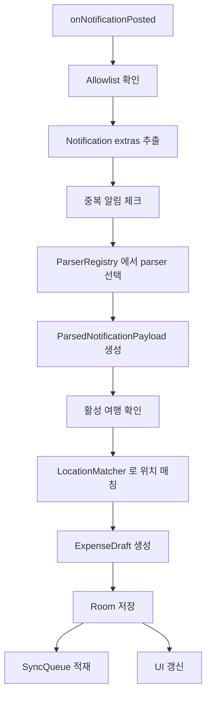

# TRIPLET Listener Code Structure

## 1. 목적

이 문서는 트립랫에서 테스트용 결제 알림을 읽어 지출 데이터로 바꾸는 listener 구조를 정의한다.

핵심 목표는 아래 세 가지다.

- 발표 시연 중 안정적으로 알림을 읽는다.
- parser 를 단순하고 디버그 가능하게 만든다.
- 이후 실제 카드사 앱 parser 로 확장 가능한 구조를 유지한다.

## 2. 설계 원칙

- `NotificationListenerService` 는 얇게 유지한다.
- 무거운 로직은 별도 processor/usecase 로 위임한다.
- 패키지 allowlist 로 대상 알림을 제한한다.
- parser 는 포맷 버전별로 교체 가능해야 한다.
- 알림 원문 저장, 파싱, 위치 매칭, 지출 생성은 단계별로 분리한다.

## 3. 패키지 구조 제안

```text
app/src/main/java/com/triplet/service/notification/
  PaymentNotificationListenerService.kt
  NotificationEventProcessor.kt
  NotificationAllowlist.kt
  NotificationPayloadExtractor.kt
  NotificationDeduplicator.kt
  NotificationParserRegistry.kt
  parser/
    PaymentNotificationParser.kt
    DemoPaymentNotificationParser.kt
  parsermodel/
    ExtractedNotificationPayload.kt
    ParsedNotificationPayload.kt
    PaymentCandidate.kt
  mapper/
    ParsedPayloadToExpenseDraftMapper.kt
  debug/
    NotificationDebugLogger.kt
```

## 4. 처리 파이프라인



## 5. 클래스별 책임

## 5.1 `PaymentNotificationListenerService`

안드로이드 시스템과 직접 연결되는 진입점

주요 책임:

- `onListenerConnected()` 로그
- `onNotificationPosted(StatusBarNotification)` 수신
- `onNotificationRemoved(StatusBarNotification)` 선택 처리
- 수신 이벤트를 processor 로 전달

주의:

- Android N 이상에서는 callback 이 메인 스레드에서 호출될 수 있으므로, 즉시 IO dispatcher 로 넘긴다.

### 예시 흐름

```kotlin
override fun onNotificationPosted(sbn: StatusBarNotification) {
    serviceScope.launch {
        processor.processPostedNotification(sbn)
    }
}
```

## 5.2 `NotificationAllowlist`

읽을 앱을 제한하는 역할

### MVP 데모 기준 허용 패키지

- `com.triplet.demo.notifier`

### 확장 포인트

나중에 실제 카드사 앱을 붙일 때 아래처럼 늘릴 수 있다.

- `com.kbcard.app`
- `com.shcard.smartpay`
- `viva.republica.toss`

## 5.3 `NotificationPayloadExtractor`

StatusBarNotification 에서 parser 가 읽을 수 있는 공통 모델을 만든다.

추출 대상:

- `packageName`
- `postTime`
- `channelId`
- `title`
- `text`
- `subText`
- `bigText`
- `extras Bundle`

### 추출 우선순위

1. `Notification.extras`
2. `Notification.EXTRA_TITLE`
3. `Notification.EXTRA_TEXT`
4. `Notification.EXTRA_SUB_TEXT`
5. `Notification.EXTRA_BIG_TEXT`

## 5.4 `NotificationDeduplicator`

같은 알림이 여러 번 처리되는 것을 막는다.

중복 판단 기준 예시:

- packageName
- tx_id
- postTime
- amount_minor
- merchant

간단히는 `tx_id` 가 있으면 그 값을 가장 우선적으로 사용한다.

## 5.5 `NotificationParserRegistry`

어떤 parser 를 적용할지 결정한다.

### 동작 순서

1. 패키지명 확인
2. format marker 또는 extras version 확인
3. 적절한 parser 반환

### MVP 데모에서는

- `DemoPaymentNotificationParser` 하나만 등록해도 충분하다.

## 5.6 `DemoPaymentNotificationParser`

테스트 알림 포맷을 실제 지출 후보로 변환하는 핵심 parser

입력:

- ExtractedNotificationPayload

출력:

- ParsedNotificationPayload

파싱 전략:

1. custom extras 우선
2. title/text fallback
3. 필수값 누락 시 parse failure

## 5.7 `ParsedPayloadToExpenseDraftMapper`

parser 결과를 Room 저장용 draft 로 변환한다.

출력 예시:

- source = `NOTIFICATION`
- merchantNormalized
- amountMinor
- occurredAt
- category
- note
- reviewStatus 초기값

## 5.8 `LocationMatcher`

결제 시점과 가장 가까운 위치 샘플을 찾는다.

입력:

- activeTripId
- occurredAt

출력:

- matched latitude / longitude / accuracy
- confidence
- reviewStatus 제안값

## 5.9 `NotificationDebugLogger`

발표 준비 단계에서는 디버깅이 매우 중요하다.

기록 권장 항목:

- 패키지명
- channelId
- title
- text
- extras 주요 키
- parse 성공/실패 여부
- parse 실패 이유

## 6. 데이터 모델 제안

## 6.1 `ExtractedNotificationPayload`

```kotlin
data class ExtractedNotificationPayload(
    val packageName: String,
    val channelId: String?,
    val postTime: Long,
    val title: String?,
    val text: String?,
    val subText: String?,
    val bigText: String?,
    val extras: Bundle
)
```

## 6.2 `ParsedNotificationPayload`

```kotlin
data class ParsedNotificationPayload(
    val txId: String,
    val merchantName: String,
    val amountMinor: Long,
    val currencyCode: String,
    val category: String?,
    val occurredAt: Instant,
    val note: String?,
    val parserName: String,
    val parserVersion: Int
)
```

## 6.3 `PaymentCandidate`

```kotlin
data class PaymentCandidate(
    val txId: String,
    val merchantName: String,
    val amountMinor: Long,
    val currencyCode: String,
    val occurredAt: Instant,
    val category: ExpenseCategory?,
    val latitude: Double?,
    val longitude: Double?,
    val accuracyM: Float?,
    val confidence: Float,
    val needsReview: Boolean
)
```

## 7. 핵심 처리 메서드 예시

```kotlin
suspend fun processPostedNotification(sbn: StatusBarNotification) {
    if (!allowlist.isAllowed(sbn.packageName)) return

    val extracted = extractor.extract(sbn) ?: return
    if (deduplicator.isDuplicate(extracted)) return

    val parser = parserRegistry.findParser(extracted) ?: return
    val parsed = parser.parse(extracted).getOrElse { error ->
        debugLogger.logParseFailure(extracted, error.message)
        return
    }

    val activeTrip = tripRepository.getActiveTrip() ?: return
    val matchedLocation = locationMatcher.match(activeTrip.tripId, parsed.occurredAt)
    val expenseDraft = mapper.map(parsed, activeTrip.tripId, matchedLocation)

    expenseRepository.saveParsedExpense(expenseDraft, extracted)
}
```

## 8. listener 와 parser 사이의 계약

parser 는 아래를 보장해야 한다.

- 필수값 누락 시 명확한 실패 이유 반환
- tx_id 생성이 아니라 읽기만 담당
- package allowlist 확인은 parser 밖에서 끝낸다
- 파싱 성공 시 통화/시각 포맷이 정규화되어 있어야 한다

listener 는 아래를 보장해야 한다.

- 알림 수집과 persistence 를 연결한다
- heavy work 를 백그라운드 coroutine 으로 넘긴다
- active trip 와 sync queue 를 확인한다

## 9. 추천 로그 포인트

- listener 연결 성공
- 알림 수신
- allowlist 통과 여부
- extras version 감지
- parser 선택 결과
- parse 실패 이유
- 위치 매칭 결과
- expense 저장 성공 여부

## 10. 데모 모드와 상용 모드의 차이

### 데모 모드

- parser 1개
- 허용 패키지 1개
- format version 고정
- 디버그 로그 풍부하게 유지

### 상용 확장 시

- parser registry 에 여러 parser 등록
- 가맹점 정규화 규칙 추가
- 패키지별 title/text 패턴 관리
- parser test fixture 확대

## 11. 구현 우선순위

1. PaymentNotificationListenerService
2. NotificationAllowlist
3. NotificationPayloadExtractor
4. DemoPaymentNotificationParser
5. NotificationEventProcessor
6. Debug logger
7. Deduplicator
