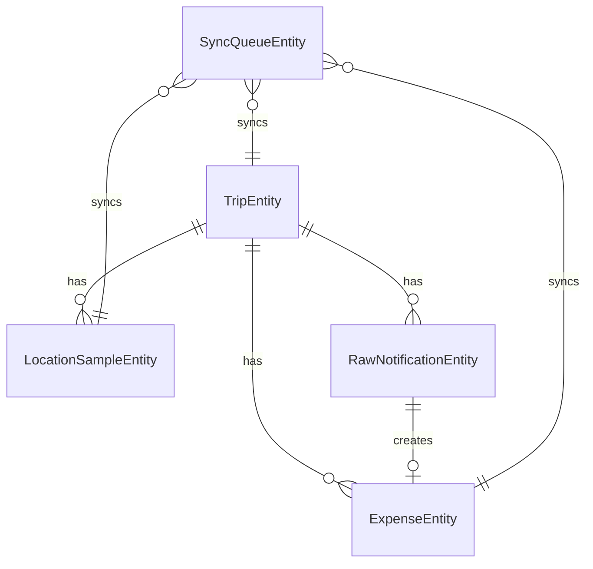

# TRIPLET Room Schema

## 1. 설계 원칙

- 로컬 DB는 앱의 진짜 소스 오브 트루스다.
- 서버 업로드 여부와 상관없이 사용자가 앱에서 본 데이터는 항상 Room에서 읽는다.
- 엔티티는 `수집 원본`, `정규화 결과`, `동기화 상태`를 구분해서 설계한다.
- 파싱 실패/매칭 실패도 데이터로 남겨서 재처리 가능하게 만든다.

## 2. 엔티티 관계



## 3. Room 엔티티 목록

### 필수 엔티티

- `TripEntity`
- `LocationSampleEntity`
- `RawNotificationEntity`
- `ExpenseEntity`
- `SyncQueueEntity`

### 선택 엔티티

- `PlaceCacheEntity`
  - Places API 호출 비용 절감을 위한 캐시
- `ExpenseCategoryRuleEntity`
  - 반복적으로 수정한 카테고리를 자동 학습하기 위한 규칙

MVP에서는 선택 엔티티 없이 시작해도 된다.

## 4. 공통 타입 컨버터

Room에는 아래 타입 변환기가 필요하다.

- `Instant <-> Long`
- `LocalDate <-> String`
- `Enum <-> String`
- `List<String> <-> JSON String`

## 5. 엔티티 상세 설계

## 5.1 TripEntity

```kotlin
@Entity(
    tableName = "trip",
    indices = [
        Index(value = ["serverId"], unique = true),
        Index(value = ["status"]),
        Index(value = ["createdAt"])
    ]
)
data class TripEntity(
    @PrimaryKey val tripId: String,
    val serverId: String?,
    val title: String,
    val countryCode: String?,
    val cityName: String?,
    val baseCurrency: String,
    val displayCurrency: String,
    val startDate: LocalDate,
    val endDate: LocalDate?,
    val status: TripStatus,
    val travelModeEnabled: Boolean,
    val createdAt: Instant,
    val startedAt: Instant?,
    val endedAt: Instant?,
    val lastSyncedAt: Instant?,
    val isDeleted: Boolean
)
```

### 설명

- 여행 하나를 나타내는 최상위 엔티티다.
- `travelModeEnabled`는 현재 여행모드 상태를 나타낸다.
- `status`는 화면 표현과 서버 동기화 모두에 사용한다.

### 추천 상태값

- `DRAFT`
- `ACTIVE`
- `PAUSED`
- `FINISHED`
- `ARCHIVED`

## 5.2 LocationSampleEntity

```kotlin
@Entity(
    tableName = "location_sample",
    foreignKeys = [
        ForeignKey(
            entity = TripEntity::class,
            parentColumns = ["tripId"],
            childColumns = ["tripId"],
            onDelete = ForeignKey.CASCADE
        )
    ],
    indices = [
        Index(value = ["tripId", "capturedAt"]),
        Index(value = ["tripId", "syncStatus"]),
        Index(value = ["geohash7"])
    ]
)
data class LocationSampleEntity(
    @PrimaryKey val sampleId: String,
    val serverId: String?,
    val tripId: String,
    val latitude: Double,
    val longitude: Double,
    val accuracyM: Float,
    val speedMps: Float?,
    val bearing: Float?,
    val provider: String?,
    val captureReason: LocationCaptureReason,
    val capturedAt: Instant,
    val geohash7: String?,
    val syncStatus: SyncStatus,
    val isDeleted: Boolean
)
```

### 설명

- 여행모드 중 수집한 위치 샘플이다.
- 지도 경로와 결제 위치 매칭의 기준 데이터다.
- `captureReason`은 디버깅과 품질 개선에 중요하다.

### 추천 captureReason

- `TRIP_START`
- `PERIODIC`
- `PAYMENT_NEARBY`
- `MANUAL_REFRESH`

## 5.3 RawNotificationEntity

```kotlin
@Entity(
    tableName = "raw_notification",
    foreignKeys = [
        ForeignKey(
            entity = TripEntity::class,
            parentColumns = ["tripId"],
            childColumns = ["tripId"],
            onDelete = ForeignKey.CASCADE
        )
    ],
    indices = [
        Index(value = ["tripId", "postedAt"]),
        Index(value = ["packageName"]),
        Index(value = ["parseStatus"]),
        Index(value = ["contentHash"], unique = true)
    ]
)
data class RawNotificationEntity(
    @PrimaryKey val rawNotificationId: String,
    val tripId: String,
    val packageName: String,
    val title: String?,
    val text: String?,
    val subText: String?,
    val postedAt: Instant,
    val receivedAt: Instant,
    val parserVersion: Int,
    val parseStatus: ParseStatus,
    val parseErrorReason: String?,
    val contentHash: String
)
```

### 설명

- 결제 알림 원본을 짧게 저장하는 테이블이다.
- 파싱 실패를 재현하고 parser 개선에 활용할 수 있다.
- 서버에는 기본적으로 전체 원문을 올리지 않고, 로컬 또는 단기 보관 중심으로 쓴다.

### 추천 parseStatus

- `RECEIVED`
- `PARSED`
- `PARSE_FAILED`
- `IGNORED`

## 5.4 ExpenseEntity

```kotlin
@Entity(
    tableName = "expense",
    foreignKeys = [
        ForeignKey(
            entity = TripEntity::class,
            parentColumns = ["tripId"],
            childColumns = ["tripId"],
            onDelete = ForeignKey.CASCADE
        ),
        ForeignKey(
            entity = RawNotificationEntity::class,
            parentColumns = ["rawNotificationId"],
            childColumns = ["rawNotificationId"],
            onDelete = ForeignKey.SET_NULL
        )
    ],
    indices = [
        Index(value = ["tripId", "occurredAt"]),
        Index(value = ["tripId", "category"]),
        Index(value = ["tripId", "reviewStatus"]),
        Index(value = ["tripId", "syncStatus"]),
        Index(value = ["placeId"]),
        Index(value = ["areaCode"]),
        Index(value = ["geohash7"])
    ]
)
data class ExpenseEntity(
    @PrimaryKey val expenseId: String,
    val serverId: String?,
    val tripId: String,
    val rawNotificationId: String?,
    val source: ExpenseSource,
    val merchantRaw: String?,
    val merchantNormalized: String?,
    val amountMinor: Long,
    val currencyCode: String,
    val category: ExpenseCategory,
    val note: String?,
    val occurredAt: Instant,
    val latitude: Double?,
    val longitude: Double?,
    val accuracyM: Float?,
    val placeId: String?,
    val placeName: String?,
    val addressText: String?,
    val areaCode: String?,
    val areaName: String?,
    val geohash7: String?,
    val matchConfidence: Float?,
    val reviewStatus: ReviewStatus,
    val manualEdited: Boolean,
    val syncStatus: SyncStatus,
    val isDeleted: Boolean
)
```

### 설명

- 사용자가 보는 실제 지출 데이터다.
- 자동 수집과 수동 입력을 모두 이 엔티티로 표현한다.
- 통계, 지도, 내역, 동기화의 중심 테이블이다.

### 추천 source

- `NOTIFICATION`
- `MANUAL`
- `IMPORTED`

### 추천 category

- `FOOD`
- `CAFE`
- `TRANSPORT`
- `ACCOMMODATION`
- `SHOPPING`
- `ACTIVITY`
- `ETC`

### 추천 reviewStatus

- `AUTO_CONFIRMED`
- `NEEDS_REVIEW`
- `USER_CONFIRMED`
- `USER_REJECTED`

## 5.5 SyncQueueEntity

```kotlin
@Entity(
    tableName = "sync_queue",
    indices = [
        Index(value = ["state"]),
        Index(value = ["entityType", "entityId"]),
        Index(value = ["nextRetryAt"])
    ]
)
data class SyncQueueEntity(
    @PrimaryKey val queueId: String,
    val entityType: SyncEntityType,
    val entityId: String,
    val operation: SyncOperation,
    val state: SyncQueueState,
    val retryCount: Int,
    val nextRetryAt: Instant?,
    val lastErrorCode: String?,
    val lastErrorMessage: String?,
    val createdAt: Instant,
    val updatedAt: Instant
)
```

### 설명

- 서버 업로드가 필요한 작업을 보관한다.
- 앱 종료, 네트워크 장애, 서버 오류가 있어도 데이터 유실 없이 재시도할 수 있다.

### 추천 entityType

- `TRIP`
- `EXPENSE`
- `LOCATION_SAMPLE`

### 추천 operation

- `UPSERT`
- `DELETE`

### 추천 state

- `PENDING`
- `IN_PROGRESS`
- `FAILED`
- `DONE`

## 6. DAO 설계

### TripDao

- 활성 여행 조회
- 여행 생성/수정/종료
- 여행별 상태 갱신

### LocationSampleDao

- 여행별 위치 샘플 저장
- 특정 시각 기준 가장 가까운 샘플 조회
- 지도 경로용 위치 리스트 조회

### RawNotificationDao

- 알림 원문 저장
- 파싱 상태 갱신
- 중복 알림 제거

### ExpenseDao

- 여행별 지출 내역 조회
- 카테고리별/일자별 합계 조회
- 검토 필요 건 조회
- 지도 마커용 데이터 조회

### SyncQueueDao

- pending queue 적재
- 다음 재시도 대상 조회
- 실패/완료 상태 갱신

## 7. 핵심 쿼리 예시

### 7.1 결제 시각과 가장 가까운 위치 찾기

```sql
SELECT *
FROM location_sample
WHERE tripId = :tripId
ORDER BY ABS(capturedAt - :expenseTime)
LIMIT 1
```

### 7.2 여행별 총지출

```sql
SELECT COALESCE(SUM(amountMinor), 0)
FROM expense
WHERE tripId = :tripId AND isDeleted = 0
```

### 7.3 카테고리별 합계

```sql
SELECT category, SUM(amountMinor) AS totalAmount
FROM expense
WHERE tripId = :tripId AND isDeleted = 0
GROUP BY category
ORDER BY totalAmount DESC
```

### 7.4 지도 마커 리스트

```sql
SELECT expenseId, placeName, amountMinor, latitude, longitude, occurredAt
FROM expense
WHERE tripId = :tripId
  AND latitude IS NOT NULL
  AND longitude IS NOT NULL
  AND isDeleted = 0
ORDER BY occurredAt ASC
```

## 8. 트랜잭션 설계

결제 알림 처리 시 아래 작업은 하나의 DB 트랜잭션으로 묶는 것을 권장한다.

1. RawNotification 저장
2. 알림 파싱 결과 생성
3. 가장 가까운 위치 샘플 탐색
4. Expense 저장
5. SyncQueue 적재

이렇게 해야 중간 실패 시 정합성이 깨지지 않는다.

## 9. 삭제 전략

### 로컬

- 기본은 hard delete 대신 `isDeleted = true`
- UI에서는 삭제된 행을 숨긴다.
- 서버 동기화가 끝난 뒤에만 정리 배치로 완전 삭제 가능

### 서버

- API에는 delete 이벤트를 보내고 서버도 soft delete를 사용

## 10. 데이터 보존 전략

- `RawNotificationEntity`는 7~30일 보관 후 삭제 가능
- `LocationSampleEntity`는 여행 종료 후 축약본만 남기고 원본 정리 가능
- `ExpenseEntity`와 `TripEntity`는 사용자가 삭제하기 전까지 보관

## 11. 이후 확장 포인트

- `PlaceCacheEntity`
- 카테고리 자동 분류 규칙 테이블
- 환율 스냅샷 테이블
- 동행자/정산 테이블
